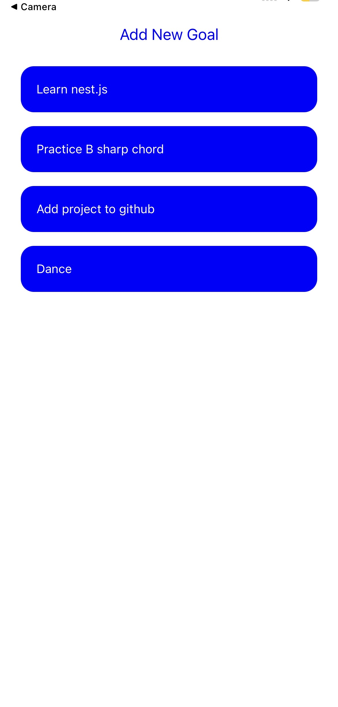
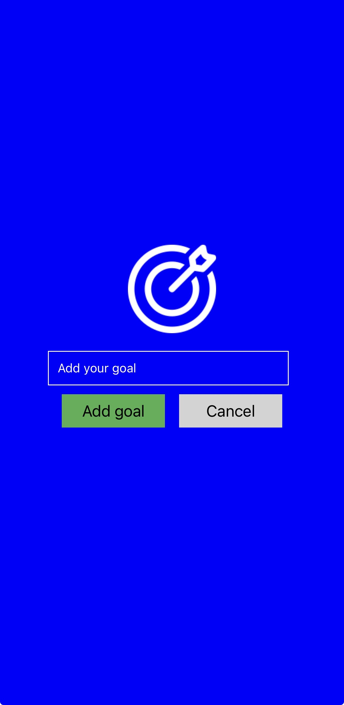
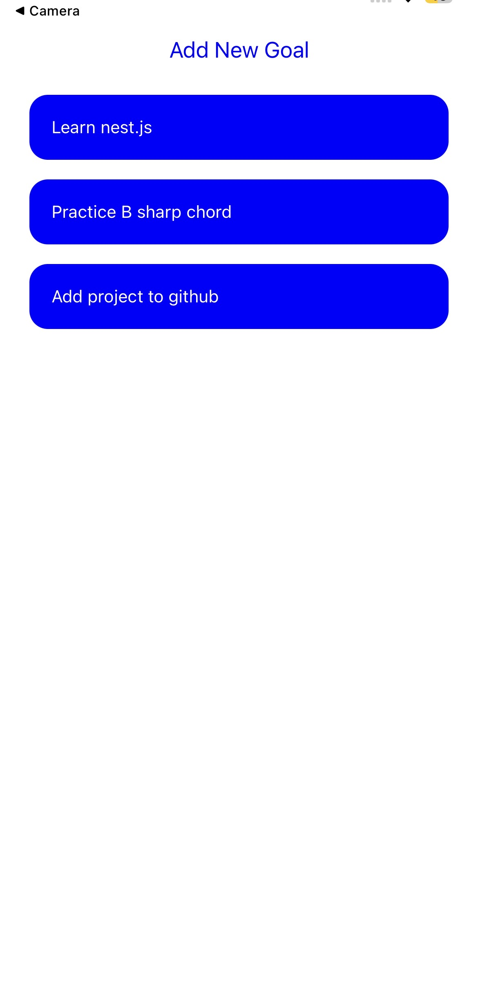

# 📱 React Native Goals App

A simple and clean React Native app to add, view, and delete daily goals.  
Built using **React Native (Expo)** with a focus on learning core concepts like state management, component communication, and UI handling.

---

## 🚀 Features

- ✅ Add new goals
- ❌ Prevent empty inputs
- 🗑️ Delete goals on tap
- 📋 Optimized list using FlatList
- 🎯 Modal input for better UX
- ⌨️ Keyboard handling (auto dismiss)
- 📱 Cross-platform (Android & iOS)
- 📱 KeyboardAvoidingView (to avoid UI hiding below keyboard)

---

## 🛠️ Tech Stack

- React Native
- Expo
- JavaScript (ES6)
- Hooks (`useState`)
- FlatList (for performance)
- KeyboardAvoidingView
- Pressable (better than using buttons)

---

## 📸 Screenshots

### 🏠 Home Screen


### ➕ Add Goal (Modal)


### 🗑️ Delete Goal


---

## ⚙️ Installation & Setup

1. Clone the repo

```bash
git clone https://github.com/your-username/goals-app.git
cd goals-app
npm install
npx expo start